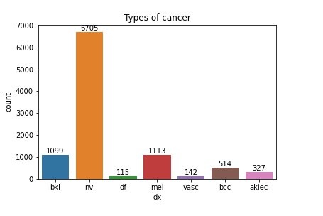
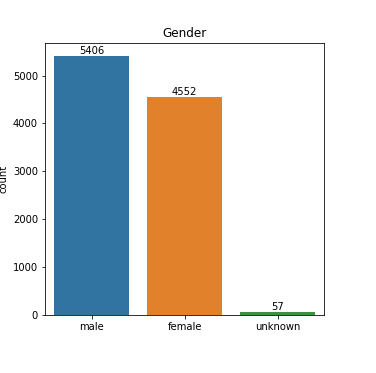
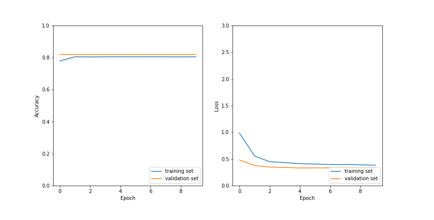

# Skin Cancer Detection

## Description

This project consists in creating a CNN model for the health care company **skinCare**, for automated diagnosis of common pigmented skin lesions, commonly called 'moles'.

## Mission objectives

- Be able to apply a CNN in a real context
- Be able to preprocess data for computer vision

# Installation

## Python version
* Python 3.9

## Packages used
* os
* pandas
* numpy
* matplotlib.pyplot
* itertools
* pickle
* seaborn
* opencv
* PIL
* sklearn
* tensorflow.keras

# Usage
| File                | Description                                                    |
|---------------------|----------------------------------------------------------------|
| main.py         | Main python code|
| utils/.py         | Python code with Neural network model|
| utils/plotting.py         | Python code for visuals (dataset and results)|

| /visuals            | Folder including the plots presented on the Readme |

# The Dataset

The dataset used for the model can be found at  https://www.kaggle.com/kmader/skin-cancer-mnist-ham10000 
It was created by Tschandl et al. 2018. 
[Tschandl, P., Rosendahl, C. & Kittler, H. *The HAM10000 dataset, a large collection of multi-source dermatoscopic images of common pigmented skin lesions*. Sci. Data 5, 180161 doi:10.1038/sdata.2018.161 (2018)].

## Data visualization

The dataset consists of 10015 images of the different skin lesion types, and a csv files, including the metadata, as labels (type of lesion), gender, localization, etc. 

### Different types of pigmented skin lesions:

There are seven types of skin deceases on the dataset:

1. **Actinic keratoses and intraepithelial carcinoma (Bowen's disease) (akiec)** :
These are variants of squamous cell carcinoma that can be treated locally without surgery,
and commonly non-invasive. 

2. **Basal cell carcinoma (bcc)**: 
Basal cell carcinoma is a common variant of epithelial skin cancer that rarely metastasizes but grows destructively if untreated.

3. **Benign keratosis-like lesions (bkl)**:
These are solar lentigines, seborrheic keratoses and lichen-planus like keratoses. 
They are similar biologically and often reported under the same generic term histopathologically.

4. **Dermatofibroma (df)**:
Benign skin lesion regarded as either a benign proliferation or an inflammatory reaction to minimal trauma. 
Its common representation is reticular lines at the periphery with a central white patch denoting fibrosis.

5. **Melanoma (mel)**: 
It is the deadliest type of skin cancer. It  is a malignant neoplasm derived from melanocytes that may appear in different variants.

6. **Melanocytic nevi (nv)**:
Benign neoplasms of melanocytes, which appear in many variants (all included here).
In contrast to melanoma, they are usually symmetric with regard to the distribution of color and structure.

7. **Vascular lesions (vasc)**:
Those can be angiomas, angiokeratomas, pyogenic granulomas or hemorrhage. They are pigmented by hemoglobin and not by melanin.

The dataset distribution:

### Gender and age distribution

### Body's localization of the lesion

# Model

## Multiclass model

## Binary model

# Website
https://share.streamlit.io/maartenvdbulcke/mole_detection/development

# Conclusion

# Contributors
| Name                  | Github                                 |
|-----------------------|----------------------------------------|
|Jacques Declercq  | https://github.com/JacquesDeclercq | 
| Graciela Lopez Rosson | https://github.com/GracielaLopezRosson |
|Bilal Mesmoudi | https://github.com/BMesm |
|Maarten Van den Bulcke| https://github.com/MaartenVdBulcke/ |

# Timeline
20-09-2021 to 24-09-2021
